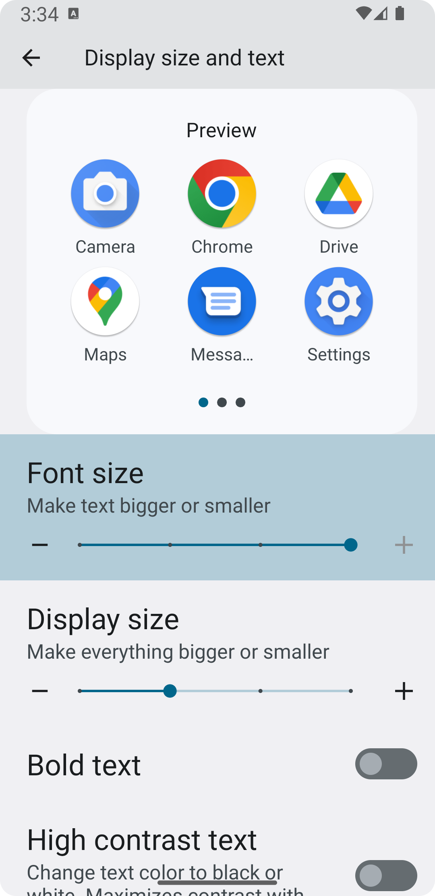
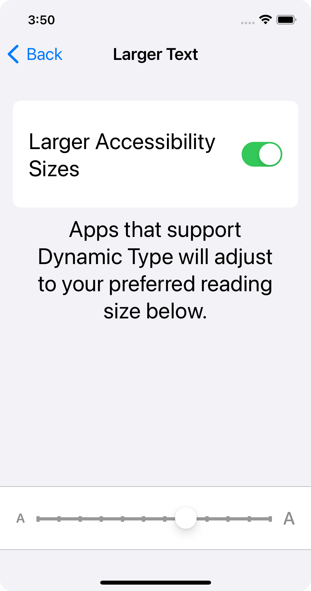

[](https://github.com/myopic-design/defold-fontscale/actions)

# Defold FontScale

Defold [native extension](https://www.defold.com/manuals/extensions/) that returns the preferred font scaling factor on the device.

- On Android, users can set the font scaling factor via **Settings > Display > Display size & text**.
- On iOS, users can set the font scaling factor via **Settings > Display and Brightness > Text Size**, or via **Settings > Accessibility > Display & Text Size > Larger Text**.

|                              Android                               |                            iOS                             |
| :----------------------------------------------------------------: | :--------------------------------------------------------: |
|  |  |

## Platform support

Defold FontScale currently supports Android and iOS. On all other platforms, it'll return `1.0`.

Contributions are welcome!

## Installation

You can use Defold FontScale by adding it as a [library dependency](https://defold.com/manuals/libraries/#setting-up-library-dependencies) in your project:

- Use a specific version for development and release to avoid breaking changes: https://github.com/myopic-design/defold-fontscale/releases
- Use the latest version only while evaluating and testing the asset: https://github.com/myopic-design/defold-fontscale/archive/master.zip.

## Usage

Get the font scaling factor with `fontscale.get()`, and then apply it to whatever nodes you want:

```lua
if fontscale then
  local scale = fontscale.get()
  go.set("#label", "scale", vmath.vector3(scale, scale, 0))
end
```
